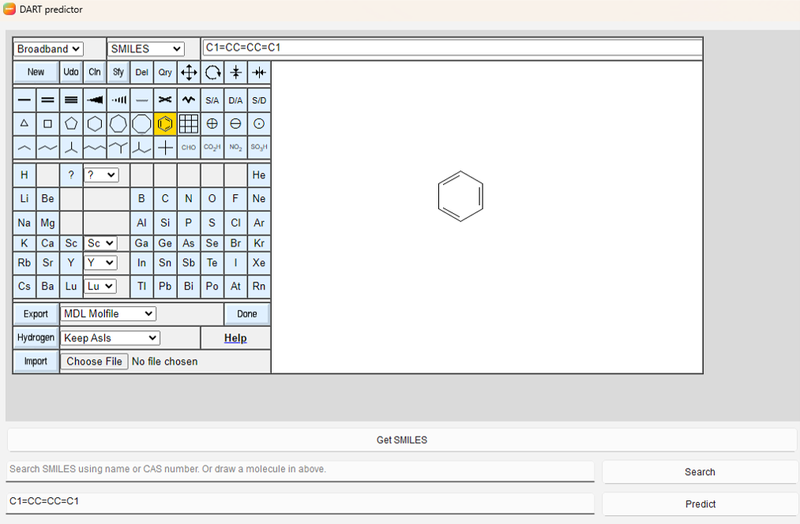

# DARTQSAR_GCN
Code for "Attention- and gate-augmented Graph Convolution Network modeling to predict the potential for Reproductive and Developmental toxicity"

# DART_Predictor
> Standalone software to deploy model based on "Attention- and gate-augmented Graph Convolution Network modeling to predict the potential for Reproductive and Developmental toxicity"

## Table of Contents
1. [Overview](#overview)
2. [System Requirements](#system-requirements)
3. [Installation](#installation)
4. [Key Features](#key-features)
5. [User Guide](#user-guide)
6. [FAQ](#faq)
7. [Version History](#version-history)

## Overview
Use this software, you can use model based on "Attention- and gate-augmented Graph Convolution Network modeling to predict the potential for Reproductive and Developmental toxicity" with structure information of specific molecule.

## System Requirements

### Minimum Requirements
- OS: Windows 10 or later / macOS 10.15 or later

### Recommended Requirements
- OS: Windows 11 / macOS 13 or later

## Installation

### Download

#### Important Notes

- **Troubleshooting:**
  - If failed to extract, please contact as chltjs1921@naver.com.

## Additional Tips

- Always keep the original archive files until you verify the extracted contents
- Check the available disk space before extraction
- Make sure you have the necessary permissions for the destination folder
- Some archives may be password-protected; make sure you have the correct password

## Key Features
### Feature 1
Variety of input methods
  - Enter SMILES directly
  
  - Draw
  
  - Search
  
  - Load external file
  

### Feature 2
Not only prediction, but also visualization of molecular structure with subgraph

### Feature 3
Save and export results by html and pdf format

## User Guide
### Basic Workflow
1. Start the Program double-click DART_Predictor.exe
2. Import structure information by enter SMILES directly in the text box below, drawing structure in the canvas and click Get SMILES button to get SMILES, searching by PubChem CID or name at the search box next to the Search button with Search button, or loading external file(*.smi, *.mol, *.sdf files.) using Load button.
3. Predict toxity use Predict button below.
4. Saving and Exporting with html or pdf format. Also, you can initialize the result of prediction in the main window use Clear All button.

### Interface Overview
#### Main Window

## FAQ
If you want FAQ, please contact as chltjs1921@naver.com. Also as troubleshooting.

## Version History

### v1.0.1 (Novenber 15, 2024)
- Fix bug of prediction result

### v1.0.0 (Novenber 14, 2024)
- Initial release

---
## Support & Contact
- Email: minong960@sogang.ac.kr, chltjs1921@naver.com
- Website: https://hanbinoh.sogang.ac.kr/hanbinoh/

## License
This program is distributed under the MIT License.

### Additional Resources
- Paper:
